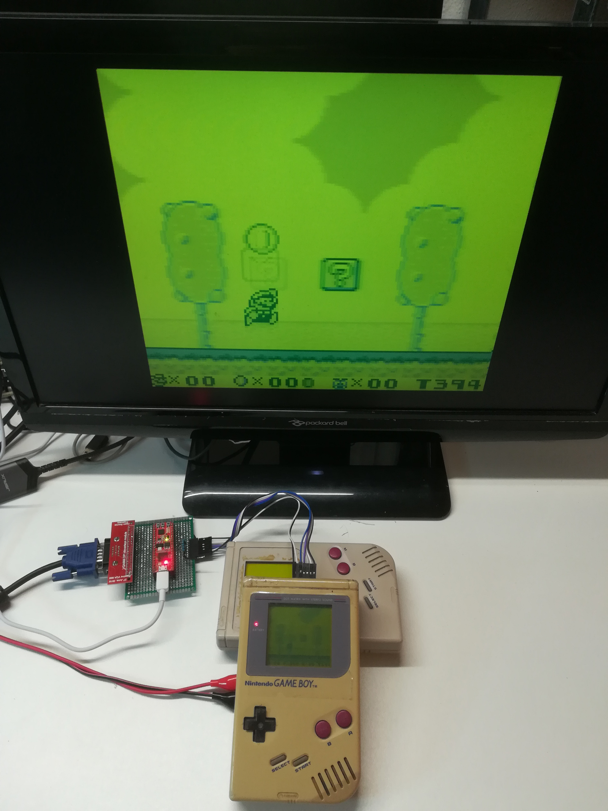
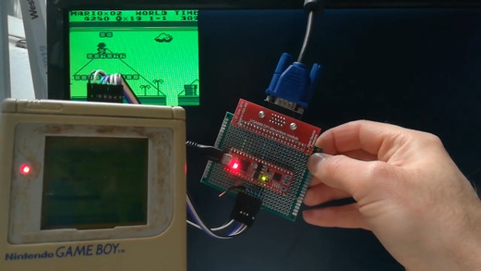

# GbVga
VGA interface for Game boy 

Clic on following image to see the video.

## Bill of material

* [GameBoy](https://en.wikipedia.org/wiki/Game_Boy)
* [fireant](https://www.crowdsupply.com/jungle-elec/fireant) efinix board.
* [VGA666](https://github.com/fenlogic/vga666)
